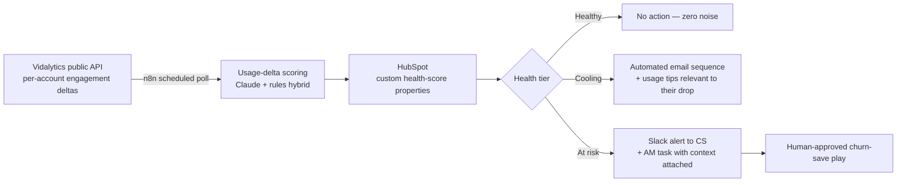

<!-- STATUS: DRAFT — for Patrick Stiles outreach (day 7 follow-up or attached
earlier if conversation opens). Requires user approval before sending anywhere.
Based on PUBLIC information only. -->

# First 90 Days of AI-Native Revenue Ops at Vidalytics — One Concrete Example

*Prepared by Ugochukwu Okoronkwo · based on public information only — the real version starts by listening to your revenue team.*

## The opportunity hiding in your own November launch

Your public API exposes per-account video-performance data. Today that data
serves your customers. The same data can serve **you** — as the earliest
churn signal you own: when a customer's videos stop converting, their reason
to pay is already eroding, weeks before they open a cancellation ticket.

## The pipeline (sketch)

## The judgment calls (the part that matters)

| Decision | Call | Why |
|---|---|---|
| n8n vs custom code | **n8n for the pipeline; TypeScript inside code steps for delta math** | Polling, routing, CRM writes are commodity orchestration — visual beats bespoke. Scoring math wants unit-testable code. |
| Where the LLM belongs | **Claude interprets *why* engagement dropped; rules decide *thresholds*** | Numeric thresholds in prompts = fragile. Claude adds value reading patterns (topic fatigue vs. traffic loss), grounded in the account's structured data. |
| Guardrails | **Nothing customer-facing fires without human approval; healthy accounts generate zero events** | Retention automation that spams healthy customers creates the churn it claims to prevent. |
| Cost control | **Batch scoring on deltas only; Claude called for changed accounts, not the full book** | LLM spend scales with churn risk, not customer count. |

## Why this first

Revenue-team AI with existing data, no new instrumentation, measurable
outcome (save-rate on at-risk accounts), and it compounds: the same
health-score properties power onboarding nudges, expansion signals, and
support prioritization later.

*I've shipped this shape of system before: an AI lead-qualification agent
(Claude + n8n + Airtable) that cut response times 30–60% — details at
github.com/Hugo0007.*
