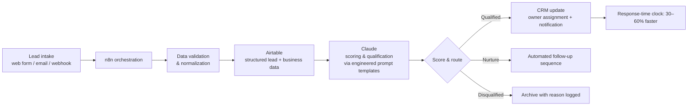

<!-- STATUS: DRAFT — NOT YET PUBLISHED. Before this goes public on github.com/Hugo0007:
  1. User confirms sanitization boundaries (no client names/data — currently none included)
  2. User verifies the workflow-mechanics description below matches reality
  3. User adds the sanitized n8n workflow export to /workflow (placeholder now)
  4. User records the Loom (script in loom-script.md) and adds the link below
-->

# AI Lead-Qualification Agent

**Claude + n8n + Airtable — an AI agent that finishes work, not a chatbot.**

Production system built for service-business sales operations: every inbound lead is captured, scored by Claude against structured business data, routed to the right owner, and written back to the CRM — end to end, with no human in the loop until a human adds value.

> **Outcome (production):** lead response times reduced **30–60%**; manual lead-processing time eliminated from the sales workflow.

📹 **90-second walkthrough:** *(Loom link — coming soon)*

## The problem

Small revenue teams lose deals in the gap between "lead arrives" and "someone qualified looks at it." Manual triage means slow first responses, inconsistent qualification criteria, and CRM records that lag reality.

## Architecture

**Key design decisions**

- **Grounded scoring, not vibes:** Claude receives structured lead and business data from Airtable — qualification criteria live in data and prompt templates, not in the model's imagination. Outputs are constrained to machine-readable fields so downstream automation never parses prose.
- **n8n as the orchestrator:** visual workflow for the 90% (webhook intake, routing, CRM sync, notifications), with code steps (JavaScript) only where logic demands it. Rebuild cost stays low; a non-developer can read the canvas.
- **Validation before AI:** malformed or duplicate leads are caught before they reach the model — the cheapest place to catch them, in both dollars and errors.
- **Human escape hatches:** edge-case leads route to a human queue with the model's reasoning attached, so review takes seconds instead of starting from zero.

## Stack

| Layer | Tool | Role |
|---|---|---|
| Orchestration | n8n | Webhook intake, routing, retries, notifications |
| AI | Anthropic Claude | Lead scoring & qualification via prompt templates |
| Data | Airtable | Structured lead store + qualification criteria |
| Integration | REST APIs, webhooks | CRM sync (Salesforce/HubSpot/Zoho pattern) |

## Repository contents

- `workflow/` — sanitized n8n workflow export *(placeholder — pending sanitization review)*
- `prompts/` — example prompt-template structure *(illustrative shape; production prompts were client-specific)*
- `loom-script.md` — walkthrough script for the video demo

## Reliability notes

- All client identifiers, credentials, and real data are stripped from this repository.
- Metrics stated are from production use and are reported exactly as measured — no extrapolation.

---

*Built by [Ugochukwu Okoronkwo](https://ugo-landing.vercel.app) — AI automation specialist (n8n · Make · Zapier · Airtable · Claude). [LinkedIn](https://linkedin.com/in/ugochukwuokoronkwo)*
